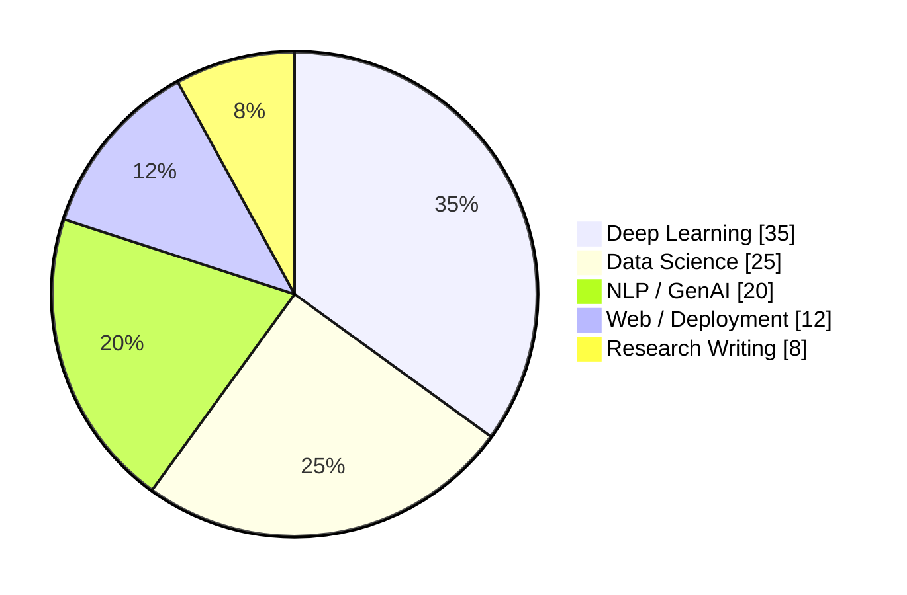

<div align="center">


<br>

<a href="https://www.linkedin.com/in/mani-ratan-159963289">
  
</a>
<a href="https://kaggle.com/mani787060">
  
</a>
<a href="mailto:mani787060@gmail.com">
  
</a>


</div>

<br>

## 🧭 About Me

<table>
<tr>
<td width="60%" valign="top">

I'm a **B.Tech CSE (AI & Data Science)** student at **IIIT Senapati, Manipur** (Class of 2027), currently a **Research Intern at IIT Roorkee**, designing deep learning architectures for multimodal emotion and personality recognition from physiological signals (EEG · ECG · GSR).

I focus on taking ML from **research notebook → production system** — not just training models, but shipping things people can actually use.

**Right now:**
- 🧬 Building a **TabTransformer + ResNet hybrid** on the ASCERTAIN dataset — outperforming the published SVM / Naive Bayes baselines
- 🚀 Shipped end-to-end ML apps across CV, NLP, and healthcare diagnostics
- 📚 Going deep on **Transformers, GANs & Diffusion Models**
- 💼 **Open to internships, research collabs & full-time AI/ML roles**

</td>
<td width="40%" valign="top">

```yaml
name: Mani Ratan
role: AI/ML Engineer
focus: Deep Learning · Multimodal AI
education: B.Tech CSE (AI & DS)
institute: IIIT Senapati, Manipur
current: Research Intern @ IIT Roorkee
status: Open to opportunities 🟢
```

</td>
</tr>
</table>

<br>

## 🛠️ Tech Stack

<div align="center">

<br>


<br><br>


&nbsp;&nbsp;


<br><br>


<br><br>


<br><br>


&nbsp;&nbsp;


<br><br>


<br><br>

</div>

<br>

## 📈 Activity Overview

<div align="center">

<table>
<tr>
<td width="55%" valign="top">

**Recent focus areas:**

🧬 Multimodal deep learning research (ASCERTAIN)
🤖 End-to-end ML app deployment
📊 Data pipelines & analytics dashboards
🩺 Healthcare diagnostic models
🔍 NLP & information extraction systems

<br>

**Currently contributing to:**
[`mani787060/mani787060`](https://github.com/mani787060/mani787060) · [`mani787060/primetrade-assignment`](https://github.com/mani787060/primetrade-assignment) and other active repositories

</td>
<td width="45%" valign="top" align="center">



</td>
</tr>
</table>

<br>

### 🐍 Contribution Snake


</div>

<br>

## 🚀 Featured Work

<table>
<tr>
<th align="left" width="32%">Project</th>
<th align="left">What it does</th>
</tr>
<tr>
<td>🧬 <a href="#"><b>Emotion & Personality Recognition</b></a><br><sub>ASCERTAIN Dataset</sub></td>
<td>TabTransformer + ResNet hybrid with modality-specific branches (EEG, ECG, GSR, EMO) — beats published baseline F1</td>
</tr>
<tr>
<td>👁️ <a href="https://github.com/mani787060/VisionChat-App"><b>VisionChat-App</b></a></td>
<td>Multimodal CV + NLP engine: image captioning, visual question answering, text-to-speech</td>
</tr>
<tr>
<td>📄 <a href="https://github.com/mani787060/AI-Resume-Analyzer"><b>AI-Resume-Analyzer</b></a></td>
<td>NLP pipeline (spaCy/NLTK) extracting candidate metrics with interactive analytics dashboards</td>
</tr>
<tr>
<td>🩺 <a href="https://github.com/mani787060/Thyroid-AI-Diagnostic"><b>Thyroid-AI-Diagnostic</b></a></td>
<td>CatBoost-ANN hybrid ensemble for high-precision thyroid disorder diagnosis</td>
</tr>
<tr>
<td>💳 <a href="https://github.com/mani787060/credit-card-fraud-detection-app"><b>Credit Card Fraud Detection</b></a></td>
<td>Streamlit app for real-time fraud detection using a trained ML model</td>
</tr>
<tr>
<td>❤️ <a href="https://github.com/mani787060/heart-disease-predictor-app"><b>Heart Disease Predictor</b></a></td>
<td>Streamlit app predicting heart disease risk from patient data</td>
</tr>
</table>

<br>

## 📊 GitHub Stats

<div align="center">


<br>


</div>

<br>

<div align="center">

### 📫 Let's Connect

<a href="https://www.linkedin.com/in/mani-ratan-159963289">
  
</a>
<a href="https://github.com/mani787060">
  
</a>
<a href="https://kaggle.com/mani787060">
  
</a>
<a href="https://sparkling-biscuit-bdf258.netlify.app">
  
</a>
<a href="mailto:mani787060@gmail.com">
  
</a>

<br><br>

<i>Open to AI/ML internships, research collaborations & full-time roles</i>


</div>
